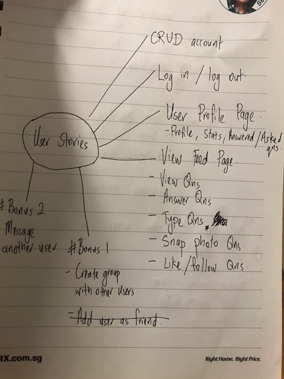

#  Project #1: The MEAN -A full stack application


### QnA.
https://cryptic-depths-63828.herokuapp.com

My **second** project at General Assembly's Web Development Immersive (WDI) Course.
* **What It Is**: Question and Answer app that allows users to post and view questions in realtime.

* **What It Can Be**:  *Forum*, *Poll*, further developed into a simple *Social Network*, you get the idea...

* **Inspiration**: *Quora*, *Padlet*


## User stories: Dream vs Reality


The above was conceptualized during the planning stage. As of now, users can:

* Login, logout locally and via facebook (feature currently down as fb deems webapp malicious)

* Post, view Questions and Answers

* View simple user stats


## ERD


### Targeted features
To tackle the problem, the application was targeted to include the following features:

* Indication of which guests have replied, are coming and have checked in.

* Indication on which tables can still be filled.

* Information of guests' latest preferences.

* Ability to overwrite guests' preferences if necessary.

* As this is a private event. Signup should be limited to those on the guest list.


### Using the Application

#### Host


#### Guests


[Try it out](https://ryanjolene.herokuapp.com)
(Note: Log in required)

## Developing the Application

### Built With

* "async": "^2.3.0"

* "bcrypt": "^1.0.2"

* "body-parser": "^1.17.1"

* "connect-flash": "^0.1.1"

* "connect-mongo": "^1.3.2"

* "dotenv": "^4.0.0"

* "ejs": "^2.5.6"

* "express": "^4.15.2"

* "express-ejs-layouts": "^2.3.0"

* "express-session": "^1.15.2"

* "flash": "^1.1.0"

* "method-override": "^2.3.8"

* "mongoose": "^4.9.4"

* "nodemon": "^1.11.0"

* "passport": "^0.3.2"

* "passport-local": "^1.0.0"

* "path": "^0.12.7"

* "sheetsu-node": "0.0.7"

* [Bootstrap](http://getbootstrap.com/)

## RESTful Routes

### Main
```
app.use('/', require('./routes/mainRouter'))
```
```
router.route('/')
.get(isLoggedIn, haveInit, mainController.getMain)

router.route('/login')
.get(isLoggedOut, mainController.getLogin)
.post(mainController.postLogin)

router.route('/changepassword')
.get(isLoggedIn, mainController.getChangePass)
.put(isLoggedIn, mainController.putChangePass)

router.route('/preference')
.get(isLoggedIn, haveInit, mainController.getPreference)
.put(isLoggedIn, haveInit, mainController.putPreference)

router.route('/logout')
.get(isLoggedIn, mainController.getLogout)
```

### Admin
```
app.use('/admin', isLoggedIn, isAdmin, require('./routes/adminRouter'))
```
```
router.route('/')
.get(adminController.getAdminManage)

router.route('/guest/add')
.get(adminController.getAdminAddGuest)
.post(adminController.postAdminAddGuest)

router.route('/guest/:id')
.get(adminController.getAdminEditGuest)
.put(adminController.editGuest)
.delete(adminController.deleteGuest)

router.route('/table/add')
.get(adminController.getAdminAddTable)
.post(adminController.postAdminAddTable)

router.route('/table/:id')
.get(adminController.getAdminEditTable)
.put(adminController.editTable)
.delete(adminController.deleteTable)

router.route('/checkin')
.get(adminController.getAdminCheckIn)

router.route('/checkin/:id')
.get(adminController.getAdminCheckInGuest)
.put(adminController.putAdminCheckInGuest)
```

## Entity Relationship Diagram (ERD)


Table was referenced in each User

### User Schema
```
var UserSchema = new mongoose.Schema({
  name:  {
    type: String,
    required: true,
    minlength: [1, 'Name must be between 1 and 99 characters'],
    maxlength: [99, 'Name must be between 1 and 99 characters'],
  },
  email: {
    type: String,
    required: true,
    unique: true,
    lowercase: true,
    match: emailRegex
  },
  password: {
    type: String,
    required: true ,
    minlength: [6, 'Password must be between 6 and 99 characters'],
    maxlength: [99, 'Password must be between 8 and 99 characters'],
  },
  admin: {
    type: Boolean,
    default: false
  },
  attending: {
    type: Boolean,
    default: false
  },
  table: {
    type: mongoose.Schema.ObjectId,
    ref: 'Table'
  },
  foodPref: {
    type: String,
    default: 'any'
  },
  headCountAllowed: {
    type: Number,
    default: 2,
    min: [1, 'Head Count Allowed must be at least 1']
  },
  headCountSelected: {
    type: Number,
    default: 1,
    min: [0, 'Head Count Selected must be at least 0'],
    max: [this.headCountAllowed, 'Head Count Selected cannot be more than Head Count Allowed']
  },
  checkedin: {
    type: Number,
    default: 0,
    min: [0, 'Number Checked in must be at least 0'],
    max: [this.headCountSelected, 'Head Count Selected cannot be more than Head Count Selected']
  },
  haveInit: {
    type: Boolean,
    default: false
  },
  permanent: {
    type: Boolean,
    default: false
  }
})
```
**Note:**

**headCountAllowed**: Quantity of guest(s) allocated to this user (includes additional guests)

**headCountSelected**: Quantity of guest(s) this user has selected

**checkedin**: Quantity of guest(s) this user has checked in

**haveInit**: true if user has set preferences for the first time

**permanent**: true if this is the default user / owner


### Table Schema

```
var TableSchema = new mongoose.Schema({
  name: {
    type: String,
    unique: true
  },
  capacity: {
    type: Number,
    default: 10,
    min: [1, 'Table capacity must be at least 1']
  },
  plannedFor: {
    type: Number,
    default: 0
  },
  reservedFor: {
    type: Number,
    default: 0
  },
  checkedIn: {
    type: Number,
    default: 0
  },
  permanent: {
    type: Boolean,
    default: false
  }
})
```
**Note:**

**plannedFor**: Quantity of guest(s) allocated to this table (includes additional guests)

**reservedFor**: Quantity of guest(s) who replied that belong to this table

**checkedIn**: Quantity of guest(s) that belong to this table who have checked in

**permanent**: true if this is the default table

### Create, Read, Update & Delete (CRUD) Process
Below are the user actions that involved both Schemas.

[**Async Series**](https://caolan.github.io/async/docs.html) was used to call functions in order.

#### Add Guest
***Steps***

1) Conduct Checks on form for errors

2) Save New User

3) Find selected table ID and increase 'plannedFor', 'reservedFor' & 'checkedIn' values from new guest

#### Edit Guest
***Steps***

1) Conduct Checks on form for errors

2) Find user's previous table ID, 'headCountAllowed', 'headCountSelected' & 'checkedin'

3) Find previous table with ID, decrease 'plannedFor', 'reservedFor' and 'checkedIn' values accordingly

4) Update user's new details

5) Find user's new table ID and increase 'plannedFor', 'reservedFor' and 'checkedIn' values accordingly

#### Delete Guest
***Steps***

1) Find user's previous table ID, 'headCountAllowed', 'headCountSelected' & 'checkedin'

2) Find previous table with ID, decrease 'plannedFor', 'reservedFor' and 'checkedIn' values accordingly

3) Remove User

#### Delete Table
***Steps***

1) Find default table ID

2) Find array of affected users

3) Find total 'headCountAllowed', 'headCountSelected' & 'checkedin' from array of users

4) Find user's default table ID and increase 'plannedFor', 'reservedFor' and 'checkedIn' values accordingly

5) Change all affected users' table ID to default table's

6) Remove selected table

### Others

#### Guest Initial Log In Process


#### Search Filter

[Reference](https://kilianvalkhof.com/2010/javascript/how-to-build-a-fast-simple-list-filter-with-jquery/)

```
jQuery.expr[':'].Contains = function(a,i,m){
  return (a.textContent || a.innerText || "").toUpperCase().indexOf(m[3].toUpperCase())>=0
}

function listFilter (searchBar, list) {
  $(searchBar).change( function () {
    var filter = $(this).val()
    if (filter) {
      $(list).find("a:not(:Contains(" + filter + "))").parent().slideUp()
      $(list).find("a:Contains(" + filter + ")").parent().slideDown()
    }
    else {
      $(list).find("li").slideDown()
    }
  }).keyup( function () {
    $(this).change()
  })
}

listFilter ($('#nameSearch'), $('#guestList'))

```
**Steps**

1) Start when there is a change on the search bar (key up)

2) Slide up the names that do not contain what was typed in the search bar

3) Slide down if nothing was typed or if the name contains what was typed into the search bar

4) Compare both in CAPS because .contains is case sensitive. Have to create a new expression .Contains that compares all in CAPS

## Future Development
[theRyanJoleneProject](https://ryanjolene.herokuapp.com) is not a complete solution yet. Feel free to add comments and suggestions to improve it!

### Possible future features / ideas

[**Sheetsu**](https://sheetsu.com)

Currently, users have to manually key in their guests one at a time. With [Sheetsu](https://sheetsu.com), they can upload / sync their guest list from google spreadsheets. [This](https://ryanjolene.herokuapp.com/admin/sheetsu) is a work in progress. Here is the
[spreadsheet example](https://docs.google.com/spreadsheets/d/1LzxY4hgAX3bS5FdHbrJUuXiDEHazgNolckqX6ZVmPRI/edit#gid=0).

UPDATE: Sheetsu's free trial has expired. Will be looking into Google Sheets API instead.

**Email / SMS Notifications**

* Automate Invite
* Allow users to reset password

**Automate fill tables according to guests' groups**

* Auto assign seating arrangement for host

**Search Sort Function**

* Need a search / sort function for the manage tables. Difficult for host to search when there are more guests.

**Accountability**

* Log date & time of changes on guest's preferences and the user who changed it.

**Delete Confirmation**

* Verify with user if they want to delete a guest.

**Event Schema**

Allow hosts to change location, time, date, picture

**Facebook Login**

Simplify the log in process

**Entertainment features for the event**

* Instragram API to view wedding couple's photos

* Socket IO for live well wishes

* See [Photodrop](https://github.com/darrelltzj/photodrop)

### Bugs
* Users can currently type an unlimited length of text for their food preferences - will have to limit that.

* Validation of table values - Currently, they can be left blank

## Author(s)

- [Darrell Teo](https://github.com/darrelltzj)

## References

* https://www.beourguest.co/ <-- Idea & Design inspiration. These guys are awesome. Would love to collaborate with them one day.

* https://kilianvalkhof.com/2010/javascript/how-to-build-a-fast-simple-list-filter-with-jquery/

* http://stackoverflow.com/questions/22246626/show-hide-children-on-parent-click

* http://jsfiddle.net/loktar/rxGmk/

## Credits

**Placeholder Picture**
* https://pixabay.com/p-2162950/?no_redirect

**Favicon**
* wedding by Gan Khoon Lay from the Noun Project
