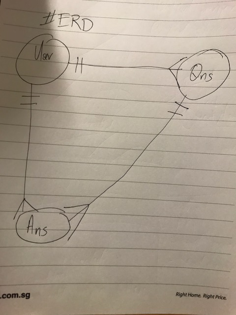

#  Project #1: The MEAN -A full stack application

### QnA.
https://cryptic-depths-63828.herokuapp.com

My **second** project at General Assembly's Web Development Immersive (WDI) Course.
* **What It Is**: Question and Answer app that allows users to post and view questions in realtime.

* **What It Can Be**:  A *Forum*, *Poll*, further developed into a simple *Social Network*, you get the idea...

* **Inspiration**: *Quora*, *Padlet*

## User stories: Dream vs Reality

The above was conceptualized during the planning stage. As of now, users can:

* Login, logout locally and via facebook (feature currently down as fb deems webapp malicious...)

* Post, view Questions and Answers

* View simple user stats

## Additional features I would have liked to have done for this project

* User to be able to manage ie. view, update, delete their questions and answers on their profile page

* 'Like' and 'follow' buttons on the questions to generate top or followed qns for specific users

* Flash messages upon wrong passwords or taken up usernames/ emails

## ERD

### Built With

* MongoDB

* Mongoose

* Express JS

* Express- handlebars

* Node.js

* Yarn package manager

* Milligram CSS

### Acknowledgements

Shoutout to Prima Aulia (tutor), Shimei (TA) and fellow comrades at Singapore's GA WDI 11, thanks for all your help!

**Link up with me at reemza77@gmail.com!**
